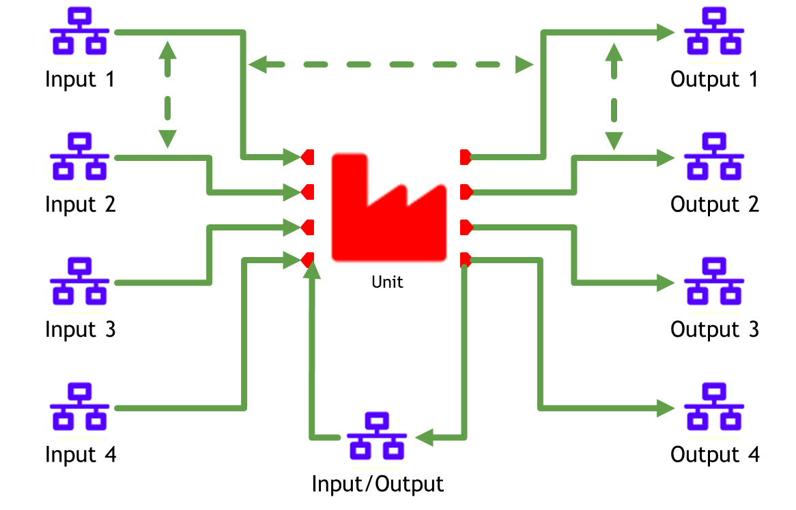
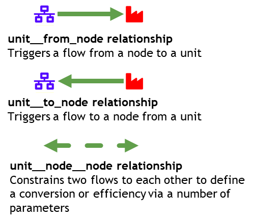
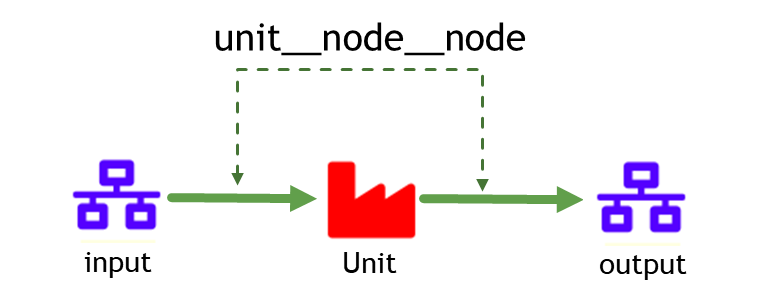
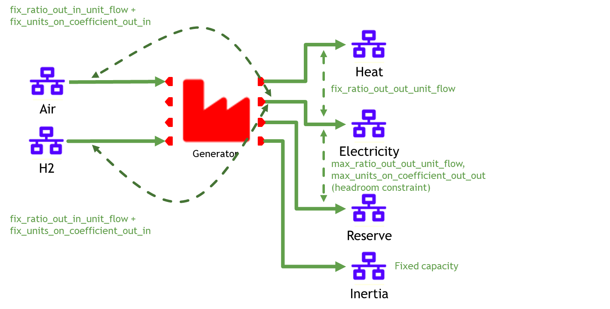

# How to define an efficiency

## relationships between the inputs and outputs of a unit

The image below shows an overview of the possible relationships between the inputs and outputs of a unit.

The key capability requirements are:
 - Easily define arbitrary numbers of input and output flows
 - Easily create piecewise affine linear relationships between any two flows
 - Anything more complicated can be done via user_constraints

## unit\_\_node\_\_node relationship

The `unit__node__node` relationship allows you to constrain two nodes to each other via a number of different parameters.:
- **unit\_incremental\_heat\_rate**: Input\_flow = `unit_incremental_heat_rate` * output\_flow + `unit_idle_heat_rate` * `units_on`.  It can be piecewise linear, used in conjunction with `operating_points` with monotonically increasing coefficients (not enforced). Used in conjunction with `unit_idle_heat_rate` triggers a fixed flow when the unit is online and `unit_start_flow` triggers a flow on a unit start (start fuel consumption)
- `fix_ratio_out_in_unit_flow`: equivalent to an efficiency. Output\_flow = `fix_ratio_out_in_unit_flow` x output\_flow + `fix_units_on_coefficient_out_in` * `units_on`. Ordering of the nodes in the `unit__node__node` relationship matters. The first node will be the output flow and the second node will be treated as the input flow (consistently with the out\_in in the parameter name. A units\_on coefficient is added with `fix_units_on_coefficient_out_in`, 
- In addition to `fix_ratio_out_in_unit_flow` you have \[constraint\]\_ratio\_\[direction1\]\_\[direction2\]\_unit\_flow where constraint can be min, max or fix and determines the sense of the constraint (max: <, min: >, fix: =) while direction1 and direction2 are used to interpret the direction of the flows involved. `In` signifies an input flow to the unit while `out` signifies an output flow from the unit. For each of these parameters, there is a corresponding \[constraint\]\_\[direction1\]\_\[direction2\]\_units\_on\_coefficient. For example: `max_ratio_in_out_unit_flow` creates the following constraint:
`input_flow` < `max_ratio_in_out_unit_flow` * `output_flow` + `max_units_on_coefficient_in_out` * `units_on`

## real world example: Compressed Air Energy Storage

To give a feeling for why these functionalities are useful, consider the following real world example for Compressed Air Energy Storage:

## known issues

That does not mean that this implementation is perfect; there are some known issues:

- Multiple ways to do the same thing (kind of)
- The ordering of nodes in `unit__node__node` relationship matters and this can be confusing
- When specifying a `unit__node__node` relationship, currently toolbox doesn’t constrain a user to choosing nodes that are connected to the unit. It’s possible to create a `unit__node__node` relationship between a unit and nodes where there are no flows. We actually need to define a relationship between two flows, which is really a relationship between a unit\_\_\[to/from\]\_node relationship and a unit\_\_\[to/from\]_node relationship.
- There is a long list of parameters (24 in total) \[fix/max/min\]\_ratio\_\[in/out\]\_\[in/out\]\_\[unit\_flow/units\_on\_coefficient\]
- `Incremental_heat_rate` supports piecewise linear but the ratio constraints don’t